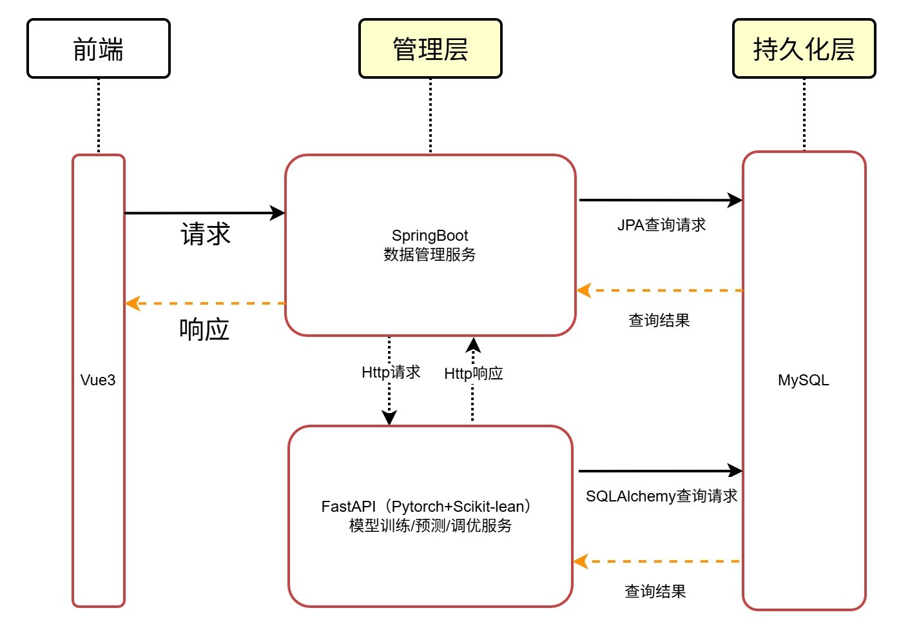

# 水质预测平台
一个简易的水质预测平台

## 目前的功能
- 自动处理并从excel表格导入国控水质检测平台的水质数据
- 基本的前端，用户注册并登入后可以管理水质数据，查看历史趋势
- 后端可利用以往的水质数据训练模型，并预测下个月的水质（目前支持SVM/AdaBoost/LSTM/GRU/Bi-RNN）


## 技术栈
- 前端：Vue3+Vite
- 后端-用户管理模块：Kotlin+SpringBoot3+JPA
- 后端-模型管理模块：FastAPI+Pandas+Scikit-learn+Pytorch

```plaintext
WaterQuality/                  # 项目根目录
├── Database/                  # 数据库相关文件
├── Import/                    # 自动导入工具
├── Module-BackEnd-FastAPI/    # 后端-模型管理模块（FastAPI）
├── Module-BackEnd-KtSpring/   # 后端-用户管理模块（SpringBoot3）
└── Module-FrontEnd-Vue/       # 前端模块（Vue3）
```

## 系统架构流程图


## 特别感谢
@Jetbrains IDE开发支持

@sctpan 本项目部分引用其水质检测系统的代码